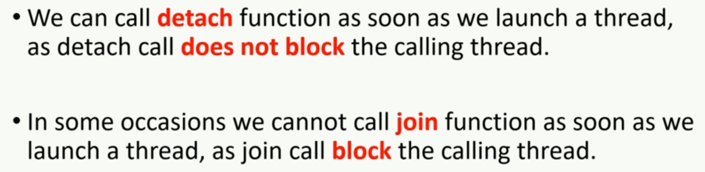

# Thread Management Guide

## Process

### Context 

Processor running multiple processes in a round robin manner by doing context switching

### Thread

A process contains atleast 1 thread called main thread, which is the entry point for the program.

Analogy

A Ship with a Captain and his crew. Crew reports to the captain.

Memory

Threads of a process share the memory, whereas different processes run on seperate memory spaces.

### Parallel processing

Modern computers have multiple processors (cores). With multiple cores, processes can run in parallel without context switching. 

Example:  Building a House. 

The planning and laying foundation should happen sequentially. Whereas, the tasks such as plumming , drilling, carpenting, gardening, etc can be done parallelly. 

Similarly, process/task can be run parallely.
There can be different levels of parallelism:

1. Task level paralellism : Where each task is doing different operation on different/same data.

2. Data level paralellism: Where each task is performing same operation on different data.

## Difference between Parallelism and Concurrency 

Parallelism and Concurrency are often used interchangeably, there is a slight difference to it.

In the above image: 
Processes running on a single processor by performing context switching, gives us the notion/illusion of parallesim though it is using the processor at different time interval, this is concurrency. 

On the other hand, when each of the processes can run on different cores/processors at the same time, this is true parallelism.

## Lambda Functions

Different syntaxes of lambda function

## Joinability of threads

Properly constructed threads are joinable. The word "Properly constructed" means a callable function must be passed as an argument to the thread class constructor. Ex: `std::thread thread_1(func_1)`. 

On the otherhand the default constructed thread is non joinable. Ex: `std::thread thread_2`. `thread_2` is not joinable.

## Join and detach functions

### Join

If thread 2 is launched from thread 1, thread 1 is blocked until the thread 2 is finished executing. 

### Detach 

In this case, thread 1 is not blocked when thread 2 is launched from thread 1.

## Better Join Mechanism

